<div align="center">

<!-- Animated Header Banner -->


<!-- Typing SVG Animation -->
<a href="https://git.io/typing-svg"></a>

<!-- Animated Badges -->
<p align="center">
  
  
  
</p>

<!-- Social Links with Hover Effect -->
<p align="center">
  <a href="https://linkedin.com/in/yafa-putra" target="_blank">
    
  </a>
  <a href="https://instagram.com/yafa.ptr" target="_blank">
    
  </a>
  <a href="mailto:yafaptr@gmail.com">
    
  </a>
  <a href="https://yafa-putra.vercel.app" target="_blank">
    
  </a>
</p>

<!-- Profile Views Counter -->
<p align="center">
  
  
</p>

</div>

---

## 👨‍💻 About Me

```typescript
const yafaPutra = {
  name: "Yafa Nanda Putra",
  role: "Fullstack Developer",
  location: "Yogyakarta, Indonesia 🇮🇩",
  education: {
    degree: "Computer Science",
    semester: 6,
    status: "Active Student"
  },
  currentFocus: [
    "Building Fullstack Web Applications",
    "Mastering Microservices Architecture",
    "Exploring Cloud Technologies & DevOps"
  ],
  technologies: {
    frontend: ["React.js", "Next.js", "Vue.js", "Tailwind CSS"],
    backend: ["Node.js", "Express.js", "Laravel", "PHP"],
    database: ["MySQL", "PostgreSQL", "MongoDB"],
    tools: ["Git", "Docker", "Postman", "VS Code"]
  },
  goals2026: [
    "✅ Master Microservices Architecture",
    "✅ Contribute to Open Source Projects",
    "✅ Build Production-Ready Applications",
    "✅ Learn DevOps & Cloud Deployment"
  ],
  lifePhilosophy: "Code is poetry, debugging is the art ✨",
  openTo: ["Freelance Projects", "Internship Opportunities", "Collaboration"]
};

console.log(`${yafaPutra.name} is ready to build amazing things! 🚀`);
```

<div align="center">

### 🎯 **Quick Highlights**

</div>

<table align="center">
<tr>
<td align="center" width="33%">

<br><b>Clean Code</b>
<br>Writing maintainable & scalable code
</td>
<td align="center" width="33%">

<br><b>API Development</b>
<br>Building robust RESTful APIs
</td>
<td align="center" width="33%">

<br><b>Database Design</b>
<br>Efficient data modeling
</td>
</tr>
</table>

---

## 🛠️ Tech Stack & Tools

<div align="center">

### **Languages**

<p>
  
  
  
  
  
  
</p>

### **Frontend Development**

<p>
  
  
  
  
  
</p>

### **Backend Development**

<p>
  
  
  
  
</p>

### **Database & Storage**

<p>
  
  
  
  
</p>

### **DevOps & Tools**

<p>
  
  
  
  
  
  
</p>

</div>

---

## 🚀 Featured Projects

<div align="center">

<table>
<tr>
<td width="50%" valign="top">

### 🎓 Online Course Platform
**Academic Project** • *Mar 2025 - Jun 2025*

A comprehensive e-learning platform with complete course management features.

**🛠️ Tech Stack:**
- Frontend: `Vue.js` `Tailwind CSS`
- Backend: `Laravel`
- Database: `MySQL`

**✨ Key Features:**
- ✅ Responsive & modern UI/UX
- ✅ User & course management system
- ✅ Secure authentication
- ✅ Full CRUD operations
- ✅ Admin dashboard

<br>

</td>
<td width="50%" valign="top">

### 🏟️ Sports Field Booking System
**Academic Project** • *Mar 2025 - Jul 2025*

Real-time sports field booking platform with schedule management.

**🛠️ Tech Stack:**
- Frontend: `JavaScript` `Tailwind CSS`
- Backend: `Laravel`
- Database: `MySQL`

**✨ Key Features:**
- ✅ Online booking system
- ✅ Real-time availability
- ✅ Schedule management
- ✅ Admin dashboard
- ✅ Payment integration ready

<br>

</td>
</tr>

<tr>
<td width="50%" valign="top">

### 🏋️ Sport-On Application
**Fullstack Project**

Modern sports platform built with cutting-edge technologies.

**🛠️ Tech Stack:**
- Frontend: `Next.js` `Tailwind CSS`
- Backend: `Express.js`
- Database: `MongoDB`

**✨ Key Features:**
- ✅ Server-side rendering (SSR)
- ✅ RESTful API architecture
- ✅ NoSQL database optimization
- ✅ High performance & scalable
- ✅ Modern UI/UX design

<br>

</td>
<td width="50%" valign="top">

### 💼 Personal Portfolio
**Personal Project**

My personal portfolio showcasing projects, skills, and experience.

**🛠️ Tech Stack:**
- Framework: `Next.js`
- Styling: `Tailwind CSS`
- Deployment: `Vercel`

**✨ Key Features:**
- ✅ Responsive design
- ✅ Fast loading time
- ✅ SEO optimized
- ✅ Interactive animations
- ✅ Project showcase

**🔗 Live:** [yafa-putra.vercel.app](https://yafa-putra.vercel.app/)

</td>
</tr>
</table>

</div>

---

## 📊 GitHub Statistics

<div align="center">


<!-- Detailed Language Stats -->


</div>

---

## 🏆 GitHub Trophies

<div align="center">


</div>

---

## 📈 Contribution Activity

<div align="center">

<!-- 3D Contribution Graph -->


<!-- Detailed Stats Cards -->


</div>

---

## 💡 Learning Journey & Roadmap

```mermaid
graph LR
    A[🎯 Current Focus] --> B[Fullstack Development]
    A --> C[Microservices]
    A --> D[Cloud Technologies]
    
    B --> E[React/Next.js]
    B --> F[Node.js/Express]
    B --> G[Database Design]
    
    C --> H[Docker Containers]
    C --> I[API Gateway]
    C --> J[Service Mesh]
    
    D --> K[AWS/GCP]
    D --> L[CI/CD Pipeline]
    D --> M[Kubernetes]
    
    style A fill:#58A6FF,stroke:#1F6FEB,color:#fff
    style B fill:#1F6FEB,stroke:#58A6FF,color:#fff
    style C fill:#1F6FEB,stroke:#58A6FF,color:#fff
    style D fill:#1F6FEB,stroke:#58A6FF,color:#fff
```

<div align="center">



### 🎓 **2026 Goals & Progress**

<table>
<tr>
<td align="center" width="25%">

<br><b>Microservices</b>
<br>

<br><i>Learning Docker & K8s</i>
</td>
<td align="center" width="25%">

<br><b>Open Source</b>
<br>

<br><i>Contributing to projects</i>
</td>
<td align="center" width="25%">

<br><b>Cloud Deploy</b>
<br>

<br><i>AWS & Vercel</i>
</td>
<td align="center" width="25%">

<br><b>Production Apps</b>
<br>

<br><i>Building real projects</i>
</td>
</tr>
</table>

### 📚 **Currently Learning**


</div>

---

## 💻 Coding Activity

<div align="center">

<!-- WakaTime Stats (if you have it) -->
<!--  -->

### **This Week I Spent Time On:**

```text
TypeScript   8 hrs 25 mins   ███████████░░░░░░   45.2%
React        4 hrs 15 mins   ██████░░░░░░░░░░░   22.8%
JavaScript   2 hrs 40 mins   ████░░░░░░░░░░░░░   14.3%
PHP          1 hr 30 mins    ██░░░░░░░░░░░░░░░    8.1%
CSS          1 hr 45 mins    ██░░░░░░░░░░░░░░░    9.6%
```

</div>

---

## 🌟 Highlights & Achievements

<div align="center">

| 🏆 Achievement | 📊 Progress | 🎯 Target |
|:---|:---:|:---:|
| **Completed Projects** | 15+ | 25 |
| **Technologies Mastered** | 12+ | 20 |
| **GitHub Contributions** | 500+ | 1000 |
| **Lines of Code Written** | 50K+ | 100K |
| **Open Source Contributions** | 5+ | 20 |

<br>

### **🎖️ Certifications & Learning**


</div>

---

## 🤝 Let's Connect & Collaborate!

<div align="center">

### 💼 **I'm Open To:**

<table>
<tr>
<td align="center" width="33%">

<br><b>Freelance Projects</b>
<br><i>Let's build something amazing together!</i>
</td>
<td align="center" width="33%">

<br><b>Internship Opportunities</b>
<br><i>Ready to learn and contribute!</i>
</td>
<td align="center" width="33%">

<br><b>Open Source Collaboration</b>
<br><i>Let's make tech better!</i>
</td>
</tr>
</table>

<br>

### 📬 **Reach Me At:**

<a href="https://linkedin.com/in/yafa-putra">
  
</a>
<a href="mailto:yafaptr@gmail.com">
  
</a>
<a href="https://instagram.com/yafa.ptr">
  
</a>
<a href="https://yafa-putra.vercel.app">
  
</a>

<br><br>

### 💭 **Developer Quote of the Day**


</div>

---

<div align="center">

### 🎨 **Profile Credits**


**⭐ Open to collaboration on interesting projects!**  
**💼 Available for freelance work and internship opportunities**

<br>


**Made with 💜 by Yafa Putra**  
*Last Updated: February 2026*

</div>
